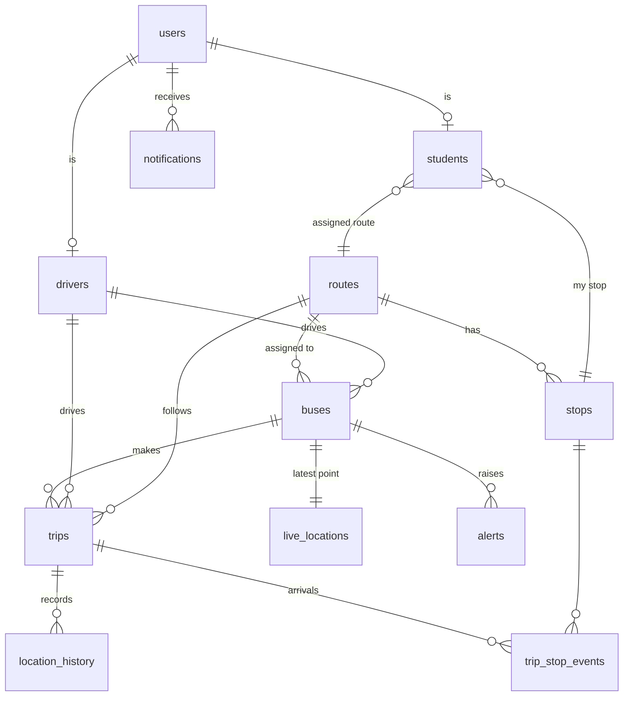

# Architecture

```
Driver phone GPS ──► Driver app (Flutter) ──Socket.IO / HTTPS──► Node.js backend ──► PostgreSQL (Neon)
                                                                     │
                                                         Socket.IO rooms: bus:<id>, admins, user:<id>
                                                                     ├──► Student app (Flutter, Google Maps)
                                                                     └──► Admin dashboard (Next.js, Google Maps)
```

## What happens to one GPS point (backend/src/services/trackingService.js)
1. **Validate user**: JWT on the socket; must be the driver of this trip.
2. **Validate trip**: must be ACTIVE and match the bus.
3. **Validate coordinates**: zod (lat -90..90, lng -180..180, speed, heading).
4. **Check accuracy**: ≤10 m EXCELLENT, ≤30 GOOD, ≤100 FAIR, >100 POOR. POOR points are stored in history (flagged) but do **not** move the bus; clients get `bus:status GPS_POOR` and keep the last reliable position.
5. **Store latest** in `live_locations` (one row per bus).
6. **Store history** in `location_history` (used for distance, replay, analytics).
7. **ETA** (`etaEngine.js`, geometry cached per route + direction): project the bus onto the route line, find the next unpassed stop, remaining distance ÷ smoothed speed + 30 s dwell per stop in between. Always labeled "Estimated arrival".
8. **Geofence** (`geofenceEngine.js`): entering a stop's radius = BUS AT STOP; leaving 1.25 × radius = BUS DEPARTED (the extra margin stops GPS jitter from flickering). Saved in `trip_stop_events` so it survives restarts.
9. **Broadcast** `bus:location` to the bus room and admins.
10. **Notify** students of that bus: started, ~1 km away, approaching (≤5 min), reached your stop, reached college. Once per stop per trip. Stored in `notifications`, pushed over Socket.IO, and via FCM when configured.

A background check every 15 s marks a bus **OFFLINE** if an active trip sends nothing for 60 s, and raises a CRITICAL alert. Overspeed (> 60 km/h) and route deviation (> 300 m from the route line) raise alerts too. All thresholds are in `backend/.env`.

## Maps
All maps are drawn with **Google Maps Platform**: Maps JavaScript API in the dashboard (`@vis.gl/react-google-maps`), Maps SDK for Android in the student and driver apps (`google_maps_flutter`). Keys are never in the code: the browser key is in `admin-dashboard/.env.local`, the Android key in each app's `android/local.properties` (`MAPS_API_KEY`), passed to the manifest by `build.gradle.kts`. The road line drawn on those maps is `routes.path`, generated by OSRM (below).

## Trip direction and road routes
- A route's stops are stored once, in **To College** order (last stop = college). Each trip has `direction`: `TO_COLLEGE` (morning) or `FROM_COLLEGE` (evening).
- For a `FROM_COLLEGE` trip the ETA engine, geofence, "next stop" and notifications use the **reversed** stop order and reversed road line ("Bus has left the college" at start, "reached the last stop" at the end).
- `roadRouteService.js` keeps `routes.path` in step with the stops: on every stop create / move / delete / re-order it asks OSRM for the road line (10 s timeout). On failure it logs a warning and the route uses straight lines; saving a stop is never blocked. The public OSRM server is for light / demo use; set `OSRM_URL` for your own.

## DEMO / SIMULATION
`npm run simulate` drives a trip from a script. Such trips are flagged `is_simulation`, every client shows a "DEMO / SIMULATION" label, students on the route get **no** notifications for them, and analytics exclude them. Demo seed rows are flagged `is_demo` and can be removed with one command.

## Database (ER summary)



## Security
- Passwords hashed with bcrypt (cost 12). JWT signed with `JWT_SECRET` (7 days).
- Role checks on every route (ADMIN / DRIVER / STUDENT); drivers can only start/end/track their own bus.
- Input validation with zod everywhere; helmet, CORS allow-list, rate limits (login 20 / 15 min, tracking 120 / min, API 600 / min).
- Users never see stack traces: errors are mapped to friendly messages; details only in server logs.
- Secrets live in `.env` / `.env.local` / `local.properties`, all git-ignored.

## Folder map
```
backend/src/config        env validation, Postgres pool
backend/src/controllers   request handlers
backend/src/middleware    auth (JWT, roles), validation, errors
backend/src/models        SQL queries
backend/src/routes        REST routes
backend/src/services      tracking, ETA, geofence, trips, road routes (OSRM), alerts, notifications, offline monitor
backend/src/sockets       Socket.IO events
backend/scripts           migrate, create-admin, demo seed, simulator
database/migrations       SQL schema
admin-dashboard/app       pages (login, dashboard, live, buses, drivers, routes, stops, students, trips, alerts, analytics, settings)
driver-app/lib            Flutter driver app
student-app/lib           Flutter student app
```
